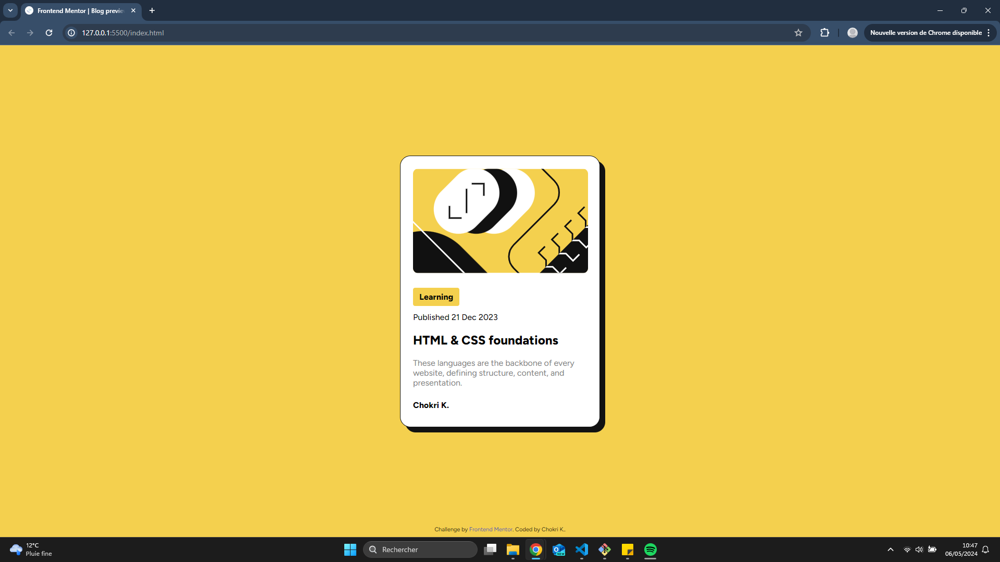
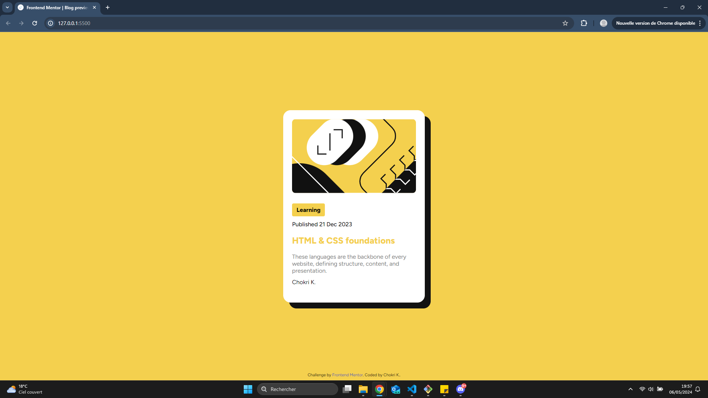
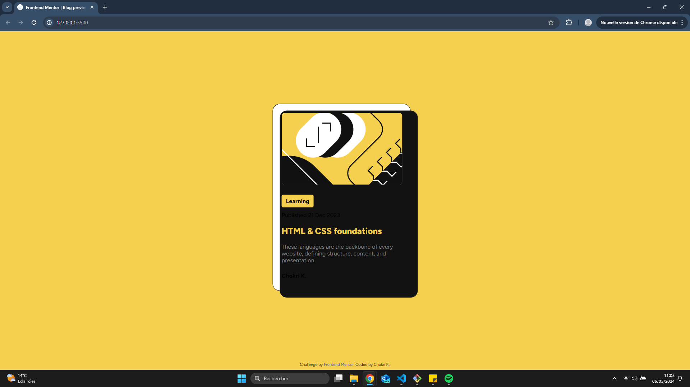

# Frontend Mentor - Blog preview card solution

This is a solution to the [Blog preview card challenge on Frontend Mentor](https://www.frontendmentor.io/challenges/blog-preview-card-ckPaj01IcS). Frontend Mentor challenges help you improve your coding skills by building realistic projects.

## Table of contents

- [Overview](#overview)
  - [The challenge](#the-challenge)
  - [Screenshot](#screenshot)
  - [Links](#links)
- [My process](#my-process)
  - [Built with](#built-with)
  - [What I learned](#what-i-learned)
  - [Issues that need to be resolved](#issues-that-need-to-be-resolved)
  - [Continued development](#continued-development)
- [Author](#author)

## Overview

### The challenge

Users should be able to:

- See hover and focus states for all interactive elements on the page

### Screenshot

### Links

- Solution URL: [here](https://blogpreviewcard-lemon.vercel.app/)

## My process

### Built with

- CSS pseudo-class (:hover)
- CSS pseudo-elements (::after)
- CSS inherit features for position

### What I learned

I tried to use the pseudo-elements ::before and ::after in my code :

- _::before_ : To insert the avatar img at the bottom of the card. Attempt failed because I wasn't able to resize the .webp image

- _::after_ : To create a second element at the back of the card for the design. I used the property **inherit** for the position, height and width.

### Issues that need to be resolved

I don't understand why the ::after element, when we hovered the card, passes in front of it. I tried to change the z-index value (from negative to positive) but the issue is still present. In the best case, the ::after element is between the card and its content :

### Continued development

What I want to develop :

- The understanding of ::before and ::after
- Happy to hear suggestions

## Author

- Github - [@chokrikadoussi](https://github.com/chokrikadoussi)
- Frontend Mentor - [@chokrikadoussi](https://www.frontendmentor.io/profile/chokrikadoussi)
